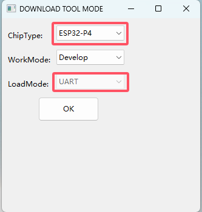
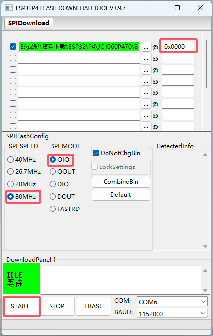
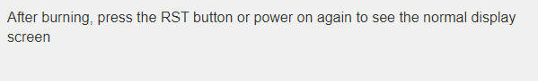

##  This is the manufacturer's documentation.

* The computer needs to install the CH340 driver program
* Ensure sufficient power supply, with a development board current of over 600mA
* Choose USB1 port for burning

Step 1

Step 2

Step 3

