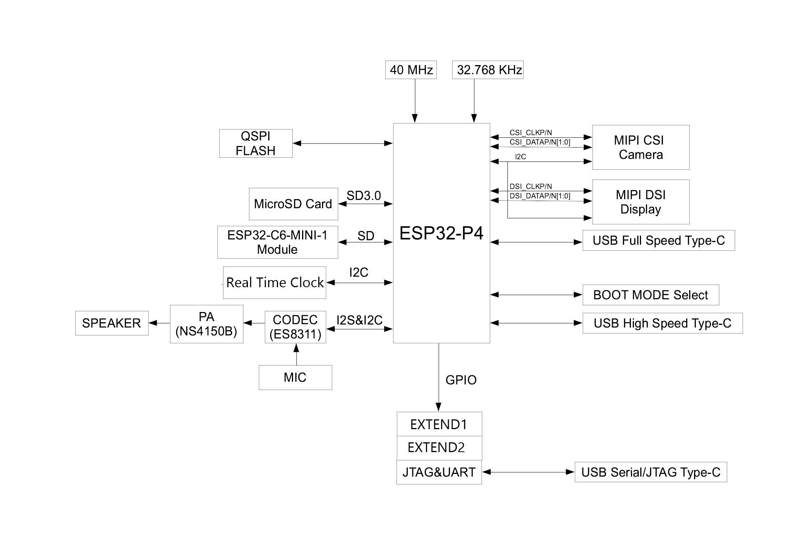

#  `U N D E R ----- C O N S T R A C T I O N !!!`

🔴 🟢 🔵 

# JC8012P4A1_BSP_ESP32P4
🟢 Board Support Package (BSP) for JC8012P4A1 (ESP32-P4). Provides support for display (JD9365 MIPI-DSI), touch (GSL3680), audio (ES8311), and co-processor (ESP32-C6). Includes full LVGL9.x integration with PPA hardware acceleration for high-performance graphics.

## Overview
🔵 JC8012P4A1 is a multimedia development board based on the ESP32-P4 chip. ESP32-P4 chip features a dual-core `RISC-V` processor and supports up to 32 MB PSRAM. In addition, ESP32-P4 supports USB 2.0 specification, MIPI-CSI/DSI, H264 Encoder, and various other peripherals. With all of its outstanding features, the board is an ideal choice for developing low-cost, high-performance, low-power network-connected audio and video products.
The 2.4 GHz Wi-Fi 6 & Bluetooth 5 (LE) module ESP32-C6-MINI-1 serves as the Wi-Fi and Bluetooth module of the board. The board also includes a 10.1-inch capacitive touch screen with a resolution of 1280 x 800 and a 2MP camera with MIPI CSI, enriching the user interaction experience. 

## Device Photos
  
  

| No. | Description                 | No. | Description                 | No. | Description                 |             
| :-: | :-------------------------- | :-: | :-------------------------- | :-: | :-------------------------- |
|  1  | USB Full Speed  (USB1 P4)   |  9  | Microphone                  |  17 | CN5 (ESP-Prog for ESP32-C6) |
|  2  | USB High Speed  (USB P4)    |  10 | EXTEND1 connector           |  18 | CN4 (I2C P4)                |
|  3  | USB from UART0 P4           |  11 | Reset button P4             |  19 | W25Q128 SPI Flash chip      |
|  4  | CN2 (UART0  P4)             |  12 | TF Card Holder              |  20 | ESP32-P4                    |
|  5  | LCD-FPC (MIPI-DSI P4)       |  13 | EXTEND2 connector           |  21 | RTC chip (RX8025T)          |
|  6  | Touch CTP-FPC               |  14 | Camera FPC (MIPI-CSI P4)    |  22 | RTC battery                 |
|  7  | ESP32-C6                    |  15 | Battery connector (3,7V)    |  23 | BOOT button P4              |
|  8  | Speaker connector           |  16 | Power button                |  24 | UART-USB chip (CH340)       |

Click to view details

-------------------

| No. | Key Component                       | Description                                                   |
| :-: |  :--------------------------------- |  :----------------------------------------------------------- |
| 1 | USB Full Speed  (USB1 P4) | USB Type-C port that supports USB 2.0 Full-speed data rate. It can be used as the power supply interface for the development board and as a communication interface. |
| 2 | USB High Speed  (USB P4) | The USB 2.0 Type-C Port is connected to the USB 2.0 OTG High-Speed interface of ESP32-P4, compliant with the USB 2.0 specification. When communicating with other devices via this port, ESP32-P4 acts as a USB device connecting to a USB host. Please note that USB 2.0 Type-C Port and USB 2.0 Type-A Port cannot be used simultaneously. USB 2.0 Type-C Port can also be used for powering the board. |
| 3 | USB from UART0 P4 | USB Serial/JTAG Port. USB Type-C port that supports USB 2.0 Full-speed data rate. It can be used to flash firmware to the ESP32-P4 chip, communicate with the chip via the USB protocol, and perform JTAG debugging. |
| 4 | CN2 (UART0  P4) | It can be used to flash firmware to the ESP32-P4 chip, communicate with the chip via the UART protocol, and perform JTAG debugging. |
| 7 | ESP32-C6 | This module serves as the Wi-Fi and Bluetooth communication module for the board. |
| 8 | Speaker connector | This port is used to connect a speaker. The maximum output power can drive a 4 Ω, 3 W speaker. |
| 9 | Microphone | Onboard microphone connected to the interface of Audio Codec Chip. |
| 12 | TF Card Holder | MicroSD Card Slot supports a MicroSD card in 4-bit mode and can store or play audio files from the MicroSD card.|
| 15 | Battery connector (3,7V) | Li-Ion battery port. |
| 16 | Power button| Li-Ion battery port. | Short press: enables / wakes the device. Long press: disables the device.
| 17 | CN5 (ESP-Prog for ESP32-C6) | The connector can be used with ESP-Prog or other UART tools to flash firmware onto the ESP32-C6 module. |
| 19 | W25Q128 SPI Flash chip | The 16 MB flash is connected to the ESP32-P4 chip via the SPI interface. (PSRAM) |
| 21 | RTC chip (RX8025T) | Real Time Clock chip |
| 22 | RTC battery  | CR1220 |
| 24 | UART-USB chip (CH340)  | Connected to UART0 ESP32-P4 |
|  | ES8311 chip | Audio Codec Chip. ES8311 is a low-power mono audio codec chip. It includes a single-channel ADC, a single-channel DAC, a low-noise pre-amplifier, a headphone driver, digital sound effects, analog mixing, and gain functions. It interfaces with the ESP32-P4 chip over I2S and I2C buses to provide hardware audio processing independent of the audio application. |
|  | NS4150B chip | Audio power amplifier Chip. 3 W mono Class D audio power amplifier that amplifies audio signals from the audio codec chip to drive speakers.|

-------------------

  

The board includes an on-board ESP32-C6 module that comes pre-flashed with ESP-Hosted-MCU slave firmware (v0.0.6). This provides Wi-Fi/Bluetooth connectivity to the on-board ESP32-P4, which acts as the host.
The ESP32-P4 can be used as a host MCU with an on-board ESP32-C6 as co-processor, already connected via SDIO as transport.

[**Click to view full schematic**](Docs & Demos/5-Schematic/README.md)

## Communication P4 with C6
[ESP-Hosted-MCU](https://github.com/espressif/esp-hosted-mcu/tree/main) is an open-source solution that allows you to use Espressif  modules (ESP32-C6) as a communication co-processor. This solution provides wireless connectivity (Wi-Fi and Bluetooth) to the host microprocessor (ESP32-P4).
ESP-Hosted-MCU library is dependent on ESP-IDF, [esp_wifi_remote](https://github.com/espressif/esp-wifi-remote/) and [protobuf-c](https://github.com/protobuf-c/protobuf-c)
### How it works 
* `ESP32-P4 Host MCU`
* `ESP32-C6 Hosted Co-Processor`
* Host extends the capabilities of the Hosted co-processor through Remote Procedure Calls (RPCs). The Host MCU sends these RPC commands to the Hosted co-processor using a reliable transport (SDIO bus). The Hosted co-processor then handles the RPC and provides the requested functionality to the Host MCU.
* The data (network or Bluetooth) is packaged efficiently at the transport layer to minimize overhead and delays when passing between the Host and co-processor.
* This modular design allows any MCU to be used as the Host, and any ESP chip with Wi-Fi and/or Bluetooth to be used as the Hosted co-processor. The RPC calls can also be extended to provide any function required by the Host, as long as the co-processor can support it.
* The RPCs implemented are [listed in this document](https://github.com/espressif/esp-hosted-mcu/blob/main/docs/implemented_rpcs.md), including the ESP-Hosted release version that implements the RPCs.

### SDIO 4-bit transport Host <-> Slave
| SDIO Function | ESP32-C6 GPIO | ESP32-P4 GPIO | Pullup | Description |
| :---          |      ---: |               ---: |   :---: | :--- |
| SD2_CLK       |      IO18 |             GPIO18 |   51k   |   |
| SD2_CMD       |      IO19 |             GPIO19 |   51k   |   |
| SD2_D0        |      IO20 |             GPIO14 |   51k   |   |
| SD2_D1        |      IO21 |             GPIO15 |   51k   |   |
| SD2_D2        |      IO22 |             GPIO16 |   51k   |   |
| SD2_D3        |      IO23 |             GPIO17 |   51k   |   |
| C6_CHIP_PU    |       EN  |             GPIO54 |   10k   | Reset C6  |
| C6_IO2        |       IO2 |              GPIO6 |         |  Wakeup P4 |

## Flashing ESP32-C6 (Optional)
🔴  Note: The ESP32-C6 comes pre-flashed with ESP-Hosted slave firmware v0.0.6, so this step is optional unless you need to update the firmware. However, it is recommended to upgrade to the latest slave firmware to get updated features and performance optimizations.

* You'll need an ESP-Prog or similar UART adapter for serial flashing.
* Connect ESP-Prog to the `CN5` header:

    | ESP-Prog | CN5_C6  | Notes                   |
    | ---      | ---     | ---                     |
    | ESP\_EN  | EN      |                         |
    | ESP\_TXD | TXD     |                         |
    | ESP\_RXD | RXD     |                         |
    | VDD      | -       | **Do not connect**      |
    | GND      | GND     |                         |
    | ESP\_IO0 | IO0     |                         |

* Put the ESP32-P4 into bootloader mode to prevent interference:

## TF Card pin assignments

On ESP32-P4, SDMMC Slot 0 GPIO pins cannot be customized. The GPIO assigned in the example should not be modified.

The table below lists the default pin assignments.

ESP32-P4 | SD card pin | Notes
---------|-------------|------------
GPIO43   | SD_CLK      | 5.1k pullup
GPIO44   | SD_CMD      | 5.1k pullup
GPIO39   | SD_DATA0    | 5.1k pullup
GPIO40   | SD_DATA1    | not used in 1-line SD mode; 5.1k pullup in 4-line mode
GPIO41   | SD_DATA2    | not used in 1-line SD mode; 5.1k pullup in 4-line mode
GPIO42   | SD_DATA3    | not used in 1-line SD mode, but card's D3 pin must have a 5.1k pullup

By default, this board uses 4 line SD mode, utilizing 6 pins: CLK, CMD, D0 - D3. It is possible to use 1-line mode (CLK, CMD, D0) by changing "SD/MMC bus width". Note that even if card's D3 line is not connected to the ESP chip, it still has to be pulled up, otherwise the card will go into SPI protocol mode.

## I2C interface

ESP32-P4 | Touch I2C | RTC        | ES8311 audio | Camera FPC5 | CN4 pin | FPC3 Expand pin | Pullup   |
---------|:---------:|------------|------------- | ----------- | ------- | --------------- | -------- |
GPIO7    | I2C_SDA   |   RTC_DAT  | ES_I2C_SDA   |  13         | 3       | 11              | R43 2.2k |
GPIO8    | I2C_SCL   |   RTC_CLK  | ES_I2C_CLK   |  14         | 4       | 12              | R44 2.2k |

## I2S audio interface

| ESP32-P4 | ES8311 audio       |  I2S  
| ---------|--------------------|-----------
| GPIO13   | CODEC_I2S0_MCLK    | I2S_MCLK
| GPIO12   | CODEC_I2S0_SCLK    | I2S_BCLK
| GPIO11   | CODEC_I2S0_SDOUT   |
| GPIO10   | CODEC_I2S0_LRCK    | I2S_LRCK
| GPIO9    | CODEC_I2S0_DSDIN   | I2S_DOUT

Audio Power Amplifier enable pin PA_CTRL connected to GPIO20 P4.

## WS2812 on-board RGB led

## Battery charge level
Battery voltage is measured using a **passive resistor divider**:

- R2 = 68 kΩ (BAT+ → ADC)
- R6 = 100 kΩ (ADC → GND)
- ADC pin: **GPIO52**

Divider ratio:
Vadc = Vbat × (100 / (68 + 100)) ≈ 0.595
Multiplier ≈ 1.68

This keeps ADC voltage safely below 3.3 V at full charge (4.2 V).

