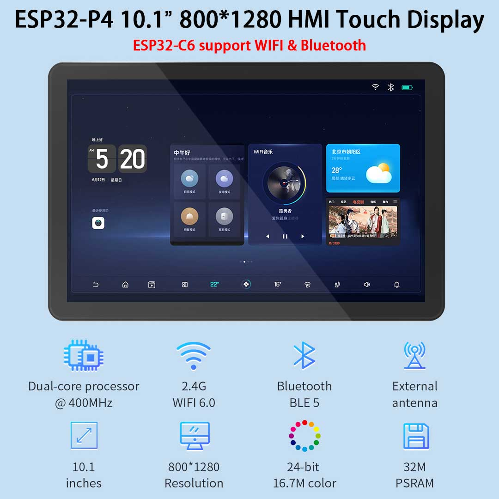
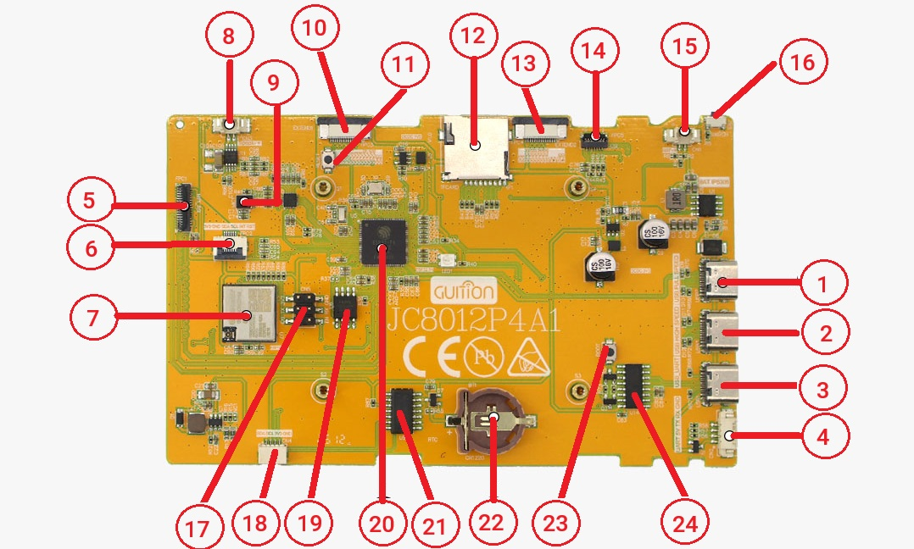

#  U N D E R   C O N S T R A C T I O N    ! !!!

# JC8012P4A1_BSP_ESP32P4
Board Support Package (BSP) for JC8012P4A1 (ESP32-P4). Provides out-of-the-box support for display (JD9365 MIPI-DSI), touch (GSL3680), audio (ES8311), and co-processor (ESP32-C6). Includes full LVGL9.x integration with PPA hardware acceleration for high-performance graphics.

## Overview
JC8012P4A1 is a multimedia development board based on the ESP32-P4 chip. ESP32-P4 chip features a dual-core RISC-V processor and supports up to 32 MB PSRAM. In addition, ESP32-P4 supports USB 2.0 specification, MIPI-CSI/DSI, H264 Encoder, and various other peripherals. With all of its outstanding features, the board is an ideal choice for developing low-cost, high-performance, low-power network-connected audio and video products.
The 2.4 GHz Wi-Fi 6 & Bluetooth 5 (LE) module ESP32-C6-MINI-1 serves as the Wi-Fi and Bluetooth module of the board. The board also includes a 7-inch capacitive touch screen with a resolution of 1024 x 600 and a 2MP camera with MIPI CSI, enriching the user interaction experience. 

## Device Photos
  
  

* Please refer to the following steps for the connection:
    * **Step 1**. According to the table below, connect the pins on the back of the screen adapter board to the corresponding pins on the development board.

        | Screen Adapter Board | ESP32-P4X-Function-EV-Board |
        | -------------------- | -------------------------- |
        | 5V (any one)         | 5V (any one)               |
        | GND (any one)        | GND (any one)              |
        | PWM                  | GPIO26                     |
        | LCD_RST              | GPIO27                     |

    * **Step 2**. Connect the FPC of LCD through the `MIPI_DSI` interface.
    * **Step 3**. Use a USB-C cable to connect the `USB-UART` port to a PC (Used for power supply and viewing serial output).
    * **Step 4**. Turn on the power switch of the board.

        | Screen Adapter Board | ESP32-P4X-Function-EV-Board |
        | -------------------- | -------------------------- |
        | 5V (any one)         | 5V (any one)               |
        | GND (any one)        | GND (any one)              |
        | PWM                  | GPIO26                     |
        | LCD_RST              | GPIO27                     |
TextText
| Header 1 | Header 2 | Header 3 |
| --- | --------------- |
|  1  | USB             |
|  2  | USB 2           |
|  3  | USB 3           |

Text
